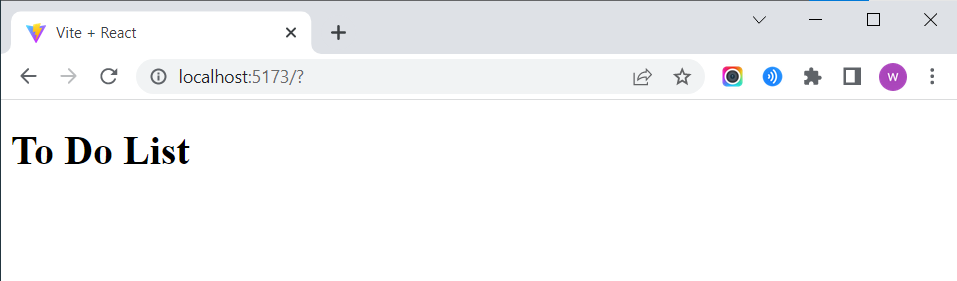
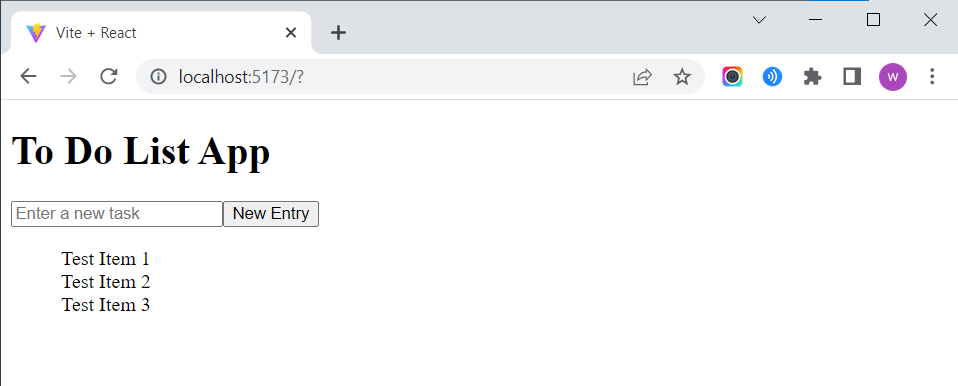
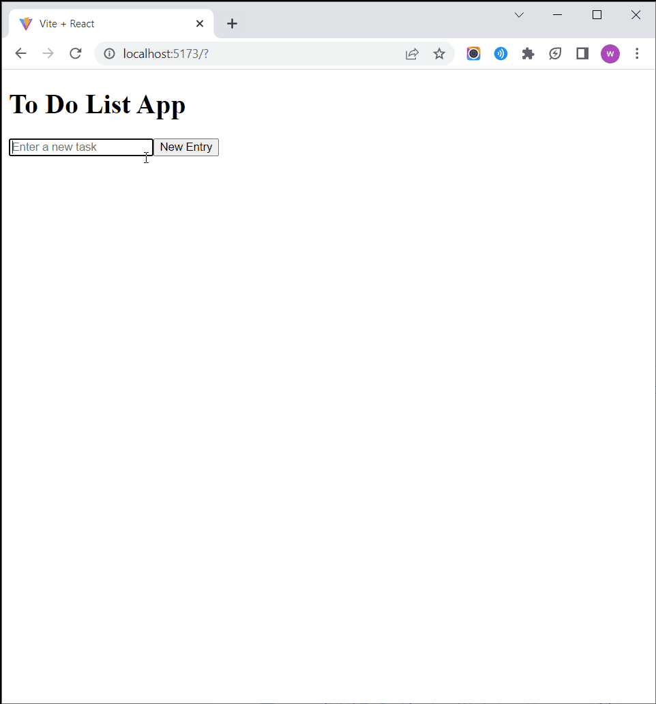

# Building the To Do List App: React and JavaScript

## Creating a React Project with Vite

> [Vite](https://vitejs.dev/guide/) is a tool that helps you build and run web applications faster and more efficiently, making it easier to develop modern web projects using popular JavaScript frameworks.

### If You're using Local Development

1. If you are coding locally (ie. using VSCode or other text editor), open a new empty folder (to store your project) and run the following command to run Vite's command line tool
   ```shell
   npm create vite@latest .
   ```
   - > ⚠️ If you are getting an error like `npm not found` or `'npm' is not recognized as an internal or external command`, make sure you've installed [npm](https://docs.npmjs.com/downloading-and-installing-node-js-and-npm) -- more information can be found in [Setup](1-setup.md)
   - Project name: `todo-list-workshop` (or whatever you want to name your project)
   - Framework: `React`
2. Next, run `npm install`
   ```shell
   npm install
   ```
   - this will install all of the necessary packages for a basic React app
   - the installed packages will be stored in the `node_modules` folder (it will automatically just pop into your current project)
3. ```shell
   npm run dev
   ```

### If You're using CodeSandbox

- Fork this sandbox: https://codesandbox.io/s/qrf93

## Intro to React

- Let's start out by understanding the basic structure of a component in React:

```jsx
import "./App.css";

function App() {
  return (
    <div className="App">
      <h1>To Do List</h1>
    </div>
  );
}

export default App;
```



## Writing the HTML

```jsx
import "./App.css";

function App() {
  return (
    <div className="App">
      <h1>To Do List App</h1>
      <form>
        <input placeholder="Enter a new task"></input>
        <button type="submit">New Entry</button>
      </form>
      <ul>
        <li>Test Item 1</li>
        <li>Test Item 2</li>
        <li>Test Item 3</li>
      </ul>
    </div>
  );
}

export default App;
```



## React States with `useState`

```jsx
import "./App.css";

function App() {
  const [todos, setTodos] = useState([]);

  return (
    <div className="App">
      <h1>To Do List App</h1>
      <form>
        <input placeholder="Enter a new task"></input>
        <button type="submit">New Entry</button>
      </form>
      <ul>
        <li>Test Item 1</li>
        <li>Test Item 2</li>
        <li>Test Item 3</li>
      </ul>
    </div>
  );
}

export default App;
```

## JavaScript Functions

### `createTodo`

```jsx
// In App.jsx, within the App() function, before the return
...
  const createTodo = (title) => {
    const newTodo = {
      id: todos.length + 1,
      title: title,
      done: false,
    };
    setTodos([...todos, newTodo]);
  };
...
```

### `toggleDone`

```jsx
// In App.jsx, within the App() function, before the return
...
  const toggleDone = (id) => {
    const todoId = todos.findIndex((entry) => entry.id === id);
    todos[todoId].done = !todos[todoId].done;
    setTodos([...todos]);
  };
...
```

### `deleteTodo`

```jsx
// In App.jsx, within the App() function, before the return
...
  const deleteTodo = (id) => {
    const updatedTodo = todos.filter((entry) => entry.id !== id);
    setTodos(updatedTodo);
  };
...
```

### Local Storage

```jsx
useEffect(() => {
  const savedTodos = JSON.parse(localStorage.getItem("todos"));
  if (savedTodos) {
    setTodos(savedTodos);
  }
}, []);

useEffect(() => {
  if (todos.length > 0) {
    localStorage.setItem("todos", JSON.stringify(todos));
  }
}, [todos]);
```

### Final App.jsx



```jsx
import { useState, useEffect } from "react";
import "./App.css";

function App() {
  const [todos, setTodos] = useState([]);
  const [title, setTitle] = useState("");

  const createTodo = (title) => {
    const newTodo = {
      id: todos.length + 1,
      title: title,
      done: false,
    };
    setTodos([...todos, newTodo]);
  };

  const toggleDone = (id) => {
    const todoId = todos.findIndex((entry) => entry.id === id);
    todos[todoId].done = !todos[todoId].done;
    setTodos([...todos]);
  };

  const deleteTodo = (id) => {
    const updatedTodo = todos.filter((entry) => entry.id !== id);
    setTodos(updatedTodo);
  };

  useEffect(() => {
    const savedTodos = JSON.parse(localStorage.getItem("todos"));
    if (savedTodos) {
      setTodos(savedTodos);
    }
  }, []);

  useEffect(() => {
    if (todos.length > 0) {
      localStorage.setItem("todos", JSON.stringify(todos));
    }
  }, [todos]);

  return (
    <div className="App">
      <h1>To Do List App</h1>
      <form
        onSubmit={(e) => {
          e.preventDefault();
          if (title === "") {
            alert("Cannot add an empty task");
            return;
          }
          createTodo(title);
          setTitle("");
        }}
      >
        <input
          value={title}
          onChange={(e) => {
            setTitle(e.currentTarget.value);
          }}
          placeholder="Enter a new task"
        ></input>
        <button type="submit">New Entry</button>
      </form>
      <ul>
        {todos.map((entry, i) => (
          <li key={entry.id} className={entry.done ? "done" : ""}>
            <input type="checkbox" onChange={() => toggleDone(entry.id)} />
            {i}. {entry.title}
            <button
              onClick={() => {
                deleteTodo(entry.id);
              }}
            >
              🗑️
            </button>
          </li>
        ))}
      </ul>
    </div>
  );
}

export default App;
```

## Making it Pretty with CSS
